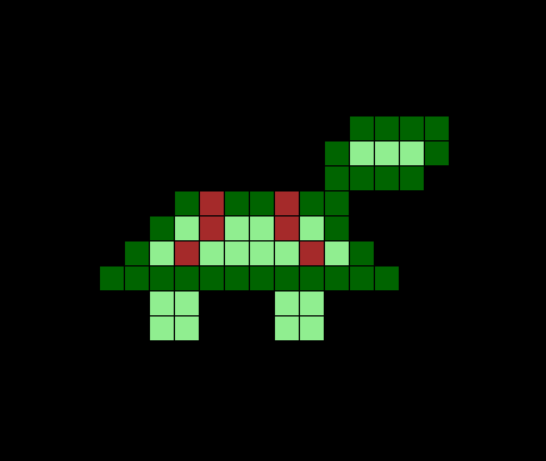

# Turtle Pixel Art



This project uses Python's `turtle` library to generate a pixel art drawing of a turtle.

## How it Works

The art is defined within `turtle_pixel_art.py` as a 2D list of numbers. The script reads this data and uses the `turtle` module to draw a grid of colored squares, forming the final image.

## How to Run

1. Ensure you have Python installed.
2. Run the script from your terminal:
   ```bash
   python turtle_pixel_art.py
   ```

A window will open displaying the turtle pixel art.
